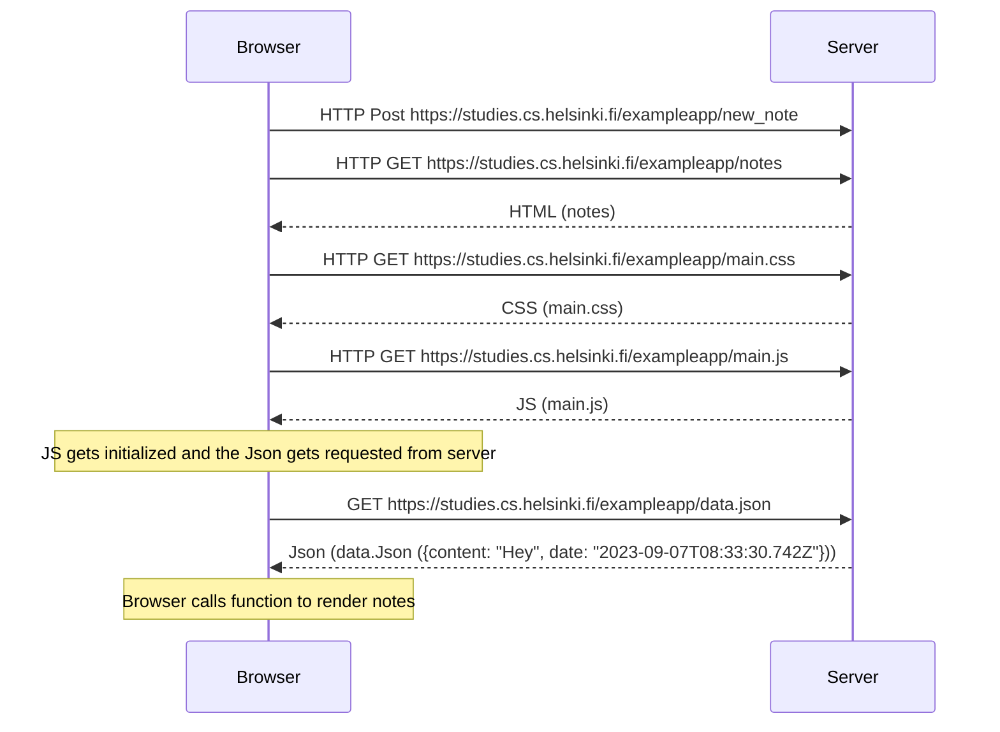

```mermaid
sequenceDiagram
    Browser->>Server: HTTP Post https://studies.cs.helsinki.fi/exampleapp/new_note
    Browser->>Server: HTTP GET https://studies.cs.helsinki.fi/exampleapp/notes
    Server-->>Browser: HTML (notes)
    Browser->>Server: HTTP GET https://studies.cs.helsinki.fi/exampleapp/main.css
    Server-->>Browser: CSS (main.css)
    Browser->>Server: HTTP GET https://studies.cs.helsinki.fi/exampleapp/main.js
    Server-->>Browser: JS (main.js)
    Note over Browser: JS gets initialized and the Json gets requested from server
    Browser->>Server: GET https://studies.cs.helsinki.fi/exampleapp/data.json
    Server-->>Browser: Json (data.Json ({content: "Hey", date: "2023-09-07T08:33:30.742Z"}))
    Note over Browser: Browser calls function to render notes
```
