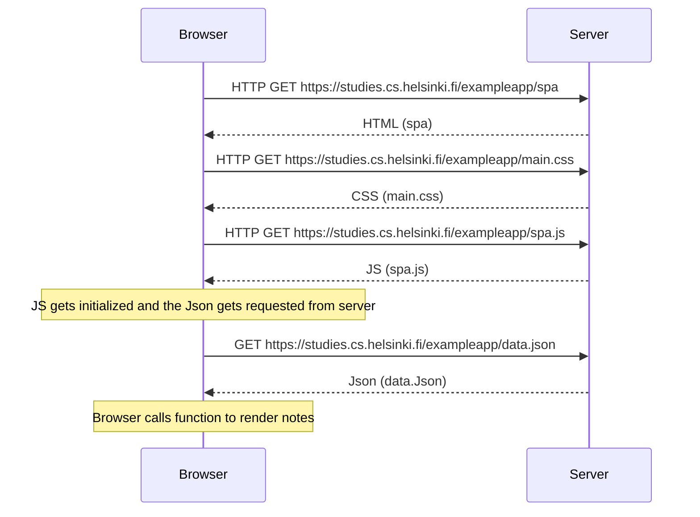

```mermaid
sequenceDiagram
    Browser->>Server: HTTP GET https://studies.cs.helsinki.fi/exampleapp/spa
    Server-->>Browser: HTML (spa)
    Browser->>Server: HTTP GET https://studies.cs.helsinki.fi/exampleapp/main.css
    Server-->>Browser: CSS (main.css)
    Browser->>Server: HTTP GET https://studies.cs.helsinki.fi/exampleapp/spa.js
    Server-->>Browser: JS (spa.js)
    Note over Browser: JS gets initialized and the Json gets requested from server
    Browser->>Server: GET https://studies.cs.helsinki.fi/exampleapp/data.json
    Server-->>Browser: Json (data.Json)
    Note over Browser: Browser calls function to render notes
```
